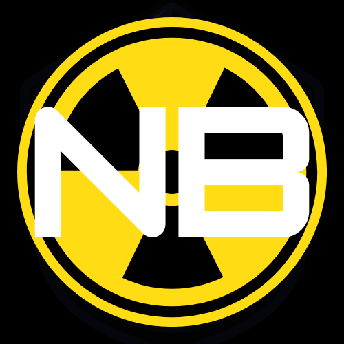

# Nukebot
\
A discord bot for nuking discord servers you have permissions on. Stupid-proof.

## Features
- ✅ Slash Commands
- ✅ Overwrite server backup template <details><summary>Info</summary> *`So they cannot revert back to how it was`*\
*`❗ Be aware of bots that may be backing up target server`*</details>
- ✅ Leave your own notes in audit logs
- ✅ Smart High-quality permission checks <details><summary>How so?</summary>*`Smart, due to Nukebot checking what it's allowed to do in the target server before we try to do anything`*</details>
## Installation
<details><summary>Easy way</summary>

Download as zip with this [direct link](https://codeload.github.com/Dr-Insanity/Nukebot/zip/refs/heads/Release).

### Instructions for easy way
>**1.)** Unzip the zip file.\
**2.)** You must have [Python 3](https://www.python.org/downloads/). At the installer, both of the below options MUST BE ticked!!!\
\
**3.)** Just double click "main.py" :D.
- ❗ This will open up a window.\
Don't close it.\
This actually runs Nukebot.\
\
If you are absolutely sure you're done with using Nukebot, you can close it without issues. Just hit the `❌` at the top-right corner of that window.

</details>
<details><summary>Advanced way</summary>

```bash
git clone --branch Release https://github.com/Dr-Insanity/Nukebot.git
```

</details>

## Usage
Nukebot has [slash commands](https://discord.com/blog/slash-commands-are-here), that will only be displayed in your own _"home"_ discord server, basically serving as your command center.

I designed it this way. For now, this is how it works because I don't see a reason to do it in some other way.